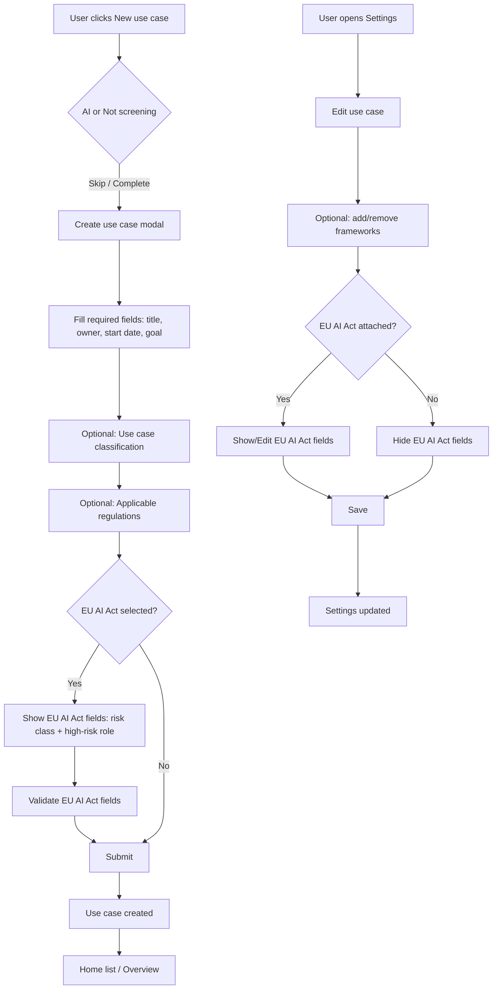

# Design Brief: Detach Regulations from Use Cases (Phase 1 MVP)

**Feature:** Detach Regulations from Use Cases  
**Phase:** 1 MVP  
**Author:** UX/UI Design  
**Date:** 2026-07-09  
**Related PRD:** Detach Regulations from Use Cases

---

## 1. Affected Screens, Flows, and Interaction Patterns

### 1.1 Use-Case Creation Flow
- **Entry:** Home (`Clients/src/presentation/pages/Home/1.0Home/index.tsx`) → “New use case” button → `AiOrNotScreening` modal → `ProjectForm` inside `StandardModal`.
- **Change:** The creation form will no longer pre-select or require EU AI Act. Framework selection becomes an optional, regulation-agnostic step. EU AI Act–specific fields appear only when EU AI Act is selected.
- **File impact:** `Clients/src/presentation/components/Forms/ProjectForm/index.tsx` and `constants.ts`.

### 1.2 Use-Case Edit / Settings Flow
- **Entry:** ProjectView → Settings tab (`Clients/src/presentation/pages/ProjectView/ProjectSettings/index.tsx`).
- **Change:** Remove the hardcoded default `monitoredRegulationsAndStandards: [{ _id: 1, name: "EU AI Act" }]`. Make “Applicable regulations” optional. AI risk classification and high-risk role move into a conditional EU AI Act subsection.
- **File impact:** `ProjectSettings/index.tsx`.

### 1.3 Legacy Create Form
- **Entry:** Any route still mounting `Clients/src/presentation/components/CreateProjectForm/index.tsx`.
- **Change:** Apply the same optional-framework and classification-field treatment so the legacy form remains consistent with the new canonical form.

### 1.4 Home / Use-Case List
- **Entry:** Home page table and card views (`Clients/src/presentation/components/ProjectsList/ProjectsList.tsx`, `ProjectTableView.tsx`).
- **Change:**
  - Stop assuming every row has a risk level and role.
  - Add a “Frameworks” column (badge list) when at least one use case has frameworks.
  - Keep “AI risk level” and “Role” columns available but hide them by default when no selected use case has EU AI Act data; show them when relevant.
  - Update grouping options and filter options to include the new classification fields.
- **File impact:** `ProjectsList.tsx`, `ProjectTableView.tsx`.

### 1.5 Project Frameworks Tab
- **Entry:** ProjectView → Frameworks/Regulations tab (`Clients/src/presentation/pages/ProjectView/ProjectFrameworks/index.tsx`).
- **Change:** The existing empty state (“No frameworks installed”) becomes the primary state for use cases created without frameworks. The “Manage frameworks/regulations” button remains the entry point for adding frameworks later.
- **File impact:** `ProjectFrameworks/index.tsx`.

### 1.6 Interaction Patterns to Apply
- **Progressive disclosure:** EU AI Act fields are shown only when EU AI Act is selected.
- **Optional tagging:** Applicable regulations use the existing multi-select Autocomplete pattern with chips.
- **Inline confirmation:** Removing the last framework from an existing use case keeps the current confirmation-modal pattern to prevent accidental data loss.
- **Undo / clear:** Each multi-select has a clear-all affordance (existing `AutoCompleteField` pattern).
- **Contextual help:** Risk-classification field keeps the “Calculate your AI risk classification” link; high-risk role keeps the external EU AI Act link.

---

## 2. Component Specifications (New or Modified)

### 2.1 `ProjectForm` — Modified
- **Location:** `Clients/src/presentation/components/Forms/ProjectForm/index.tsx`
- **Changes:**
  - Remove `framework_type` choice from the use-case creation path; default internally to project-based but do not surface it as a user decision in the use-case modal.
  - Reorder fields into three logical groups (see wireframe in §8).
  - Make `monitored_regulations_and_standards` optional and visible to all use cases.
  - Render the EU AI Act subsection only when `monitored_regulations_and_standards` contains EU AI Act (`_id === 1` or name match).
  - Add the new **Use case classification** section.
  - Update validators: remove the “at least one framework” requirement; only validate risk classification / high-risk role when EU AI Act is selected.

### 2.2 `ProjectSettings` — Modified
- **Location:** `Clients/src/presentation/pages/ProjectView/ProjectSettings/index.tsx`
- **Changes:**
  - Remove hardcoded EU AI Act default.
  - Restructure cards: “Use Case Overview”, “Project Details”, “Classification”, “Frameworks & Compliance”, “Team”, “Custom Fields”, “Danger Zone”.
  - Make “Applicable regulations” optional.
  - Move AI risk classification and type of high-risk role into a conditional card that appears only when EU AI Act is attached.
  - Preserve existing framework add/remove API behavior and confirmation modals.

### 2.3 `CreateProjectForm` (Legacy) — Modified
- **Location:** `Clients/src/presentation/components/CreateProjectForm/index.tsx`
- **Changes:** Mirror the new `ProjectForm` field order and optional-framework behavior so users landing on the legacy route have a consistent experience.

### 2.4 `ProjectsList` / `ProjectTableView` — Modified
- **Location:** `Clients/src/presentation/components/ProjectsList/ProjectsList.tsx`, `ProjectTableView.tsx`
- **Changes:**
  - Add `frameworks` (or `monitored_regulations_and_standards`) to the column config and export columns.
  - Default-visibility logic: if **any** project in the list has EU AI Act data, show “AI risk level” and “Role”; otherwise hide them by default but allow the user to enable them via the column selector.
  - Add grouping options: Category, Audience, Deployment context.
  - Add filter options for the new classification fields.

### 2.5 `ProjectFrameworks` — Modified (cosmetic)
- **Location:** `Clients/src/presentation/pages/ProjectView/ProjectFrameworks/index.tsx`
- **Changes:** No layout change; ensure empty state copy is regulation-agnostic (“No frameworks installed”) and that the “Add Framework” button is visible when no frameworks are attached.

### 2.6 New Reusable Sub-components (Recommended)
These are logical groupings, not necessarily new files, but they help keep the brief actionable:

| Component | Responsibility | Reuses |
|---|---|---|
| `FrameworkSelector` | Multi-select autocomplete for applicable regulations/standards | Existing `AutoCompleteField` / MUI `Autocomplete` |
| `UseCaseClassificationFields` | Category, purpose, audience, deployment context selects | Existing `Select` component |
| `EUAIActFields` | Risk classification + high-risk role, conditionally rendered | Existing `Select` + `RiskAnalysisModal` |
| `OptionalFieldHint` | Small helper text explaining why a section is optional | Existing `Typography` pattern |

---

## 3. Complete State Inventory for Key Components

### 3.1 Framework Selector (Applicable regulations)

| State | Visual | Behavior |
|---|---|---|
| **Default / Empty** | Input shows placeholder “Select regulations and standards (optional)”. No chips. | Click opens dropdown with all available non-organizational frameworks. |
| **Hover** | Border color shifts to `#5FA896` (per design-system hover). | Cursor pointer; dropdown trigger area highlighted. |
| **Focused** | Border 2px `brand.primary`, box-shadow `0 0 0 3px rgba(19,113,91,0.1)`. | Dropdown opens; keyboard navigation through options. |
| **Active (open)** | Dropdown list visible with options. Selected items have checkmark or highlighted background. | Arrow keys move focus; Enter selects/deselects; Escape closes. |
| **Disabled** | Background `background.accent`, border `status.default.border`, no pointer events. | Tooltip explains reason if pending approval or read-only. |
| **Loading** | Input shows skeleton shimmer or disabled state with a small inline spinner. | Framework list is being fetched; user cannot interact. |
| **Error** | Border `#FDA29B`, error text below: font 11px, opacity 0.8. | Triggered only if a backend-side validation fails (rare in Phase 1). |
| **Filled** | One or more chips appear inside the input, each with a delete icon (except the last one when only one framework is selected in Settings). | Chips can be removed via delete icon or keyboard Backspace. |

### 3.2 Use Case Classification Selects (Category, Purpose, Audience, Deployment context)

| State | Visual | Behavior |
|---|---|---|
| **Default / Empty** | Placeholder text per field; no value. | Required indicator absent (all classification fields are optional in Phase 1). |
| **Hover** | Border `#5FA896`. | Cursor pointer. |
| **Focused** | Border 2px `brand.primary`, focus ring. | Menu opens; first option receives focus. |
| **Active** | Menu open, hovered option uses `background.accent` / `brand.primary` text. | Click or Enter selects. |
| **Disabled** | Muted background, no interaction. | Used only if the whole form is read-only. |
| **Loading** | Placeholder replaced with “Loading…” and menu disabled. | Options fetched asynchronously. |
| **Error** | Red border + helper text. | Triggered on submit if a backend rule makes a field required. |
| **Filled** | Selected value displayed with `ChevronDown` icon. | Clear via selecting placeholder or a dedicated “Clear” menu item. |

### 3.3 Conditional EU AI Act Fields (AI risk classification, Type of high-risk role)

| State | Visual | Behavior |
|---|---|---|
| **Default / Hidden** | Section is not rendered. | N/A |
| **Default / Visible** | Both selects show placeholder; risk classification includes helper link “Calculate your AI risk classification”; role includes helper link. | Required indicators shown (`*`). |
| **Hover** | Same as standard Select hover. | Cursor pointer. |
| **Focused** | Same as standard Select focus. | Menu opens. |
| **Active** | Menu open. | Option selection works normally. |
| **Disabled** | Muted; tooltip if pending approval. | Not editable. |
| **Loading** | Skeleton or disabled selects. | Risk analysis modal data loading. |
| **Error** | Red border + inline message, e.g., “AI risk classification is required when EU AI Act is selected.” | Triggered on submit if EU AI Act is selected but fields are empty. |
| **Filled** | Selected value displayed. | If risk classification is set via `RiskAnalysisModal`, the select updates reactively. |

### 3.4 Submit Button (Create / Update)

| State | Visual | Behavior |
|---|---|---|
| **Default** | Contained primary button, `brand.primary` background. | Enabled when required fields are valid. |
| **Hover** | Slightly darker background or existing hover lift. | Cursor pointer. |
| **Active / Pressed** | Slight scale down or ripple (respect `disableRipple` theme setting). | Triggers submit. |
| **Focused** | Visible focus ring (2px offset). | Enter/Space submits. |
| **Disabled** | Grey background (`#ccc`), grey border. | Tooltip on hover: “Fill in required fields to continue” or similar. |
| **Loading** | Button text replaced with spinner + “Creating use case…” / “Updating use case…”. | Click disabled; existing toast overlay also appears. |
| **Error** | Button remains enabled; error toast/alert appears. | User can correct and retry. |
| **Filled context** | Button label switches between “Create use case” and “Update use case”. | N/A |

### 3.5 Home / Use-Case Table Row

| State | Visual | Behavior |
|---|---|---|
| **Default** | Row shows available data; empty cells render “—”. | Hover highlights row (`background.accent`). |
| **Hover** | Row background changes; cursor pointer. | Click navigates to overview. |
| **Active (selected/focused)** | Keyboard focus outline on row. | Enter/Space navigates. |
| **Disabled** | Not applicable. | N/A |
| **Loading** | Skeleton rows. | Data fetching. |
| **Error** | Inline alert or error row. | Fetch failure. |
| **Empty** | Empty-state illustration + tips. | Prompts to create use case. |
| **Filled (with frameworks)** | “Frameworks” column shows one or more small chips, e.g., “EU AI Act”, “NIST AI RMF”. | Hovering a chip shows full name if truncated. |

---

## 4. Accessibility Considerations

### 4.1 Keyboard
- All new `Select` and `AutoCompleteField` components must follow the existing tab order and support `Esc` to close, `Enter` to select, and arrow-key navigation.
- The conditional EU AI Act section must be announced by screen readers when it appears/disappears. Wrap the section in a live region (`aria-live="polite"`) or move focus to the first newly visible field.
- Table rows remain keyboard-operable (`tabIndex={0}`, Enter/Space handlers).

### 4.2 Screen Reader
- Framework selector label: “Applicable regulations, optional”.
- Each classification field must have a visible label and matching `htmlFor`/`id`.
- Helper links (“Calculate your AI risk classification”, external EU AI Act link) must have descriptive `aria-label`s indicating they open a modal or external site.
- Empty-state copy in `ProjectFrameworks` must be read as a single meaningful block.

### 4.3 Focus Management
- When EU AI Act is selected, focus moves to the first newly revealed field (AI risk classification) so keyboard users are not stranded.
- When EU AI Act is deselected, focus returns to the framework selector or the next logical field.
- Error summary on submit should focus the first invalid field (existing behavior preserved).

### 4.4 Color & Contrast
- All new text uses existing palette tokens (`text.primary`, `text.secondary`, `text.tertiary`).
- Error text maintains `#FDA29B` / accessible red from design system.
- Placeholder text uses `text.tertiary`; filled values use `text.primary`.

### 4.5 Touch Targets
- Chips’ delete icons and select dropdown items maintain minimum 44×44 dp tap targets where feasible; at minimum the existing 34px height is preserved.

### 4.6 Reduced Motion
- Honor `prefers-reduced-motion` for any progressive-disclosure animations (existing style guide already uses 150ms transitions; keep them subtle).

---

## 5. Responsive Behavior Specifications

### 5.1 Create/Edit Modal (`StandardModal`)
- **≥ 900px (desktop):** Two-column layout for Details + Classification; EU AI Act subsection spans full width or right column as appropriate (see §8).
- **768px – 899px (tablet):** Collapse to a single column; field width becomes 100% of modal body; section cards stack vertically.
- **< 768px (mobile):** Modal occupies full viewport width with 16px padding; inputs and selects are 100% width; chips wrap.
- **Existing `maxWidth="900px"`** on the modal is acceptable; no change required.

### 5.2 Settings Page
- **Desktop:** Current two-column grid label/value pattern (`220px` label + `1fr` value) is preserved.
- **Tablet/Mobile:** Label and value stack vertically; value input/select becomes full width.
- Framework selector maintains `400px` max width on desktop; becomes 100% on smaller screens.

### 5.3 Home Table
- **Desktop:** Full set of visible columns.
- **Tablet:** Hide “Last updated” by default; allow horizontal scroll if needed.
- **Mobile:**
  - Switch to card view by default (existing `ProjectCard`), or
  - Keep table with horizontal scroll and pin the “Use case title” column.
  - Framework badges wrap if shown.

### 5.4 Classification Fields
- The four new selects can be displayed as a 2×2 grid on desktop and a single column on mobile.

---

## 6. Copy and Content Changes Needed

### 6.1 Create / Edit Form

| Location | Current Copy | New Copy | Rationale |
|---|---|---|---|
| Modal title | “Create new use case” / “Edit use case” | Keep | Still accurate. |
| Modal description | “Create a new use case from scratch by filling in the following.” | “Create a new use case. Frameworks and EU AI Act details are optional and can be added later.” | Sets expectation that regulation is not mandatory. |
| Framework selector label | “Applicable regulations” | “Applicable regulations and standards (optional)” | Explicitly optional. |
| Framework selector placeholder | “Select regulations and standards” | “Select regulations and standards (optional)” | Reinforces optional state. |
| Framework selector helper | (none) | “Add one or more frameworks to enable compliance tracking for this use case.” | Explains value. |
| New section title | (none) | “Use case classification” | Introduces regulation-agnostic concept. |
| Category label | (none) | “Category” | New field. |
| Category placeholder | (none) | “Select a category” | New field. |
| Purpose label | (none) | “Purpose” | New field. |
| Purpose placeholder | (none) | “Select a purpose” | New field. |
| Audience label | (none) | “Audience” | New field (internal/external facing). |
| Audience options | (none) | “Internal”, “External”, “Both” | New field. |
| Deployment context label | (none) | “Deployment context” | New field. |
| Deployment context options | (none) | e.g., “Cloud”, “On-premises”, “Edge”, “Hybrid” | New field. |
| EU AI Act subsection title | (none, fields were inline) | “EU AI Act details” | Groups conditional fields. |
| AI risk classification label | “AI risk classification” | Keep, but only shown when EU AI Act selected. | Conditional. |
| Type of high-risk role label | “Type of high risk role” | Keep, but only shown when EU AI Act selected. | Conditional. |
| Submit button | “Create use case” / “Update use case” | Keep | Still accurate. |

### 6.2 Settings Page

| Location | Current Copy | New Copy | Rationale |
|---|---|---|---|
| Card title | “Team & Compliance” | Split into “Frameworks & Compliance” and “Team” | Clearer grouping. |
| Applicable regulations label | “Applicable regulations *” | “Applicable regulations and standards (optional)” | No longer required. |
| Helper under label | “Add all monitored regulations and standards of the use case.” | “Add frameworks or regulations you want to track. This is optional.” | Optional framing. |
| Warning when only one framework left | “Framework cannot be empty.” | Keep, but only shown when user attempts to remove the last framework; not a validation error. | Prevents accidental zeroing. |
| New card title | (none) | “Use case classification” | New section. |
| AI risk classification row | Always visible | Move into “EU AI Act details” card; hidden if EU AI Act not attached. | Regulation-agnostic default. |
| Type of high-risk role row | Always visible | Move into “EU AI Act details” card; hidden if EU AI Act not attached. | Regulation-agnostic default. |
| Save button | “Save” | Keep | Still accurate. |
| Success toast | “Project updated successfully” | “Use case updated successfully” | Align terminology with rest of product. |

### 6.3 Home / Use-Case List

| Location | Current Copy | New Copy | Rationale |
|---|---|---|---|
| Column header | “AI risk level” | Keep, but default-hide when no EU AI Act data exists. | Conditional relevance. |
| Column header | “Role” | Keep, but default-hide when no EU AI Act data exists. | Conditional relevance. |
| New column header | (none) | “Frameworks” | Shows attached frameworks. |
| Empty cell value | “—” | Keep | Good pattern for missing optional data. |
| Group-by option | (none) | “Category”, “Audience”, “Deployment context” | New classification grouping. |
| Filter option | (none) | “Category”, “Audience”, “Deployment context” | New classification filtering. |

### 6.4 Project Frameworks Tab

| Location | Current Copy | New Copy | Rationale |
|---|---|---|---|
| Empty-state title | “No frameworks installed” | Keep | Already regulation-agnostic. |
| Empty-state body | “This use case doesn't have any compliance frameworks yet. Add a framework to start tracking controls and assessments.” | Keep or refine to: “This use case doesn't have any frameworks yet. Add one to start tracking controls and assessments.” | Slightly more concise. |
| Button | “Add Framework” / “Manage frameworks/regulations” | Keep | Still accurate. |

---

## 7. User Flow Diagram (Mermaid)



---

## 8. Annotated Wireframe Description

### 8.1 Create / Edit Use Case Modal

**Container:** `StandardModal`, title “Create new use case” / “Edit use case”, max-width 900px, primary action “Create use case” / “Update use case”.

**Tab bar:** Two tabs — “Details” | “Custom fields”. The changes below apply to the **Details** tab only.

#### Layout (Desktop, two columns)

```text
┌─────────────────────────────────────────────────────────────┐
│  Create new use case                                        │
│  Create a new use case. Frameworks and EU AI Act details    │
│  are optional and can be added later.                       │
├─────────────────────────────────────────────────────────────┤
│  [Details] [Custom fields]                                  │
├──────────────────────────────┬──────────────────────────────┤
│  Use case title *            │  Team members                │
│  [                         ] │  [+ select users            ]│
│                              │                              │
│  Owner *                     │  Start date *    Geography * │
│  [Select owner            ▼] │  [date    ]      [Global  ▼] │
│                              │                              │
│  Use case status             │  Description                 │
│  [Not started             ▼] │  [                         ] │
│                              │                              │
│  Approval workflow           │  Target industry             │
│  [Select workflow         ▼] │  [                         ] │
│                              │                              │
├──────────────────────────────┴──────────────────────────────┤
│  Use case classification (optional)                         │
│  ┌────────────────────┐ ┌────────────────────┐             │
│  │ Category           │ │ Purpose            │             │
│  │ [Select category ▼]│ │ [Select purpose  ▼]│             │
│  └────────────────────┘ └────────────────────┘             │
│  ┌────────────────────┐ ┌────────────────────┐             │
│  │ Audience           │ │ Deployment context │             │
│  │ [Select audience ▼]│ │ [Select context  ▼]│             │
│  └────────────────────┘ └────────────────────┘             │
├─────────────────────────────────────────────────────────────┤
│  Applicable regulations and standards (optional)            │
│  [+ EU AI Act, NIST AI RMF ...                       ▼]     │
│  Add frameworks or regulations you want to track.           │
├─────────────────────────────────────────────────────────────┤
│  EU AI Act details   ← shown only when EU AI Act selected   │
│  ┌────────────────────────────┐ ┌──────────────────────────┐│
│  │ AI risk classification *   │ │ Type of high-risk role * ││
│  │ [Select an option       ▼] │ │ [Select an option     ▼] ││
│  │ Calculate your AI risk...  │ │ If you are not sure...   ││
│  └────────────────────────────┘ └──────────────────────────┘│
├─────────────────────────────────────────────────────────────┤
│  Goal *                                                       │
│  [                                                          ] │
│  [                                                          ] │
├─────────────────────────────────────────────────────────────┤
│                                       [Create use case]       │
└─────────────────────────────────────────────────────────────┘
```

#### Field Order
1. **Use case title** (required, single-line text)
2. **Owner** (required, single select)
3. **Use case status** (required, single select)
4. **Approval workflow** (optional, single select)
5. **Team members** (optional, multi-select autocomplete)
6. **Start date** (required, date picker)
7. **Geography** (required, single select)
8. **Description** (optional, multi-line text)
9. **Target industry** (optional, multi-line text)
10. **Use case classification** (optional section)
    - Category
    - Purpose
    - Audience
    - Deployment context
11. **Applicable regulations and standards** (optional, multi-select autocomplete)
12. **EU AI Act details** (conditional section)
    - AI risk classification (required if shown)
    - Type of high-risk role (required if shown)
13. **Goal** (required, multi-line text)
14. **Enable AI data insertion** checkbox (create-only, existing)

### 8.2 Settings Page

**Container:** Full page form inside ProjectView → Settings tab.

**Card structure (top to bottom):**

1. **Use Case Overview** card
   - Use case title / Description / Goal / Target industry (existing rows, label + value grid).

2. **Project Details** card
   - Owner / Start date / Geography / Use case status (existing rows).

3. **Use Case Classification** card *(new)*
   - Category / Purpose / Audience / Deployment context (label + value grid, same 220px label column).

4. **Frameworks & Compliance** card *(renamed from Team & Compliance)*
   - Applicable regulations and standards (optional, multi-select autocomplete).
   - EU AI Act details subsection *(conditional)*
     - AI risk classification
     - Type of high-risk role
   - Keep existing tooltips and confirmation modal for removing the last framework.

5. **Team** card *(split out)*
   - Team members multi-select.

6. **Custom Fields** card
   - Existing `CustomFieldsSection`.

7. **Save button row**
   - Primary “Save” button, disabled until a change is made and no validation errors exist.

8. **Danger Zone** *(existing)*
   - Delete use case.

### 8.3 Home / Use-Case Table

**Default visible columns when no EU AI Act data is present:**
- Use case ID
- Use case title
- Start date
- Frameworks *(new)*
- Last updated
- Actions

**Default visible columns when at least one use case has EU AI Act data:**
- Use case ID
- Use case title
- AI risk level
- Role
- Start date
- Frameworks *(new)*
- Last updated
- Actions

**Column selector** allows users to show/hide any column, including the new classification columns if added in a later phase. For Phase 1, classification fields live in the detail view only.

### 8.4 Project Frameworks Tab

No layout change. When no frameworks are attached, the existing empty state remains:
- Shield icon in a circular placeholder.
- Title: “No frameworks installed”.
- Body: “This use case doesn't have any frameworks yet. Add one to start tracking controls and assessments.”
- Primary button: “Add Framework”.

When frameworks are attached, the existing toggle + “Manage frameworks/regulations” button + tracker tabs remain unchanged.

---

## 9. Design Principles Applied

- **Clarity:** Every optional section is explicitly labeled “(optional)”. Conditional EU AI Act fields are grouped under a clear subsection so users understand why they appear.
- **Consistency:** All new inputs reuse existing `Field`, `Select`, and `AutoCompleteField` components, preserving the 34px height, 13px typography, and hover/focus states defined in the style guide.
- **Efficiency:** Framework selection is a single multi-select; classification uses four compact selects. No extra wizard steps are added.
- **Forgiveness:** Users can create a use case with no frameworks and add them later via Settings or the Frameworks tab. Multi-selects support chip deletion and clear-all.
- **Accessibility:** Conditional disclosure is announced, focus is managed, labels remain visible, and keyboard paths are preserved.

---

## 10. Out-of-Scope Notes (Phase 1)

- Multi-framework selection is supported technically but Phase 1 only requires making selection optional and regulation-agnostic; no new multi-select interaction paradigm is introduced.
- Downstream `framework_id === 1` hardcoded paths are not refactored as part of this design brief; the UI must still surface EU AI Act fields correctly wherever that path triggers them.
- New classification fields are optional in Phase 1; making them required or driving compliance logic from them is Phase 2+.
