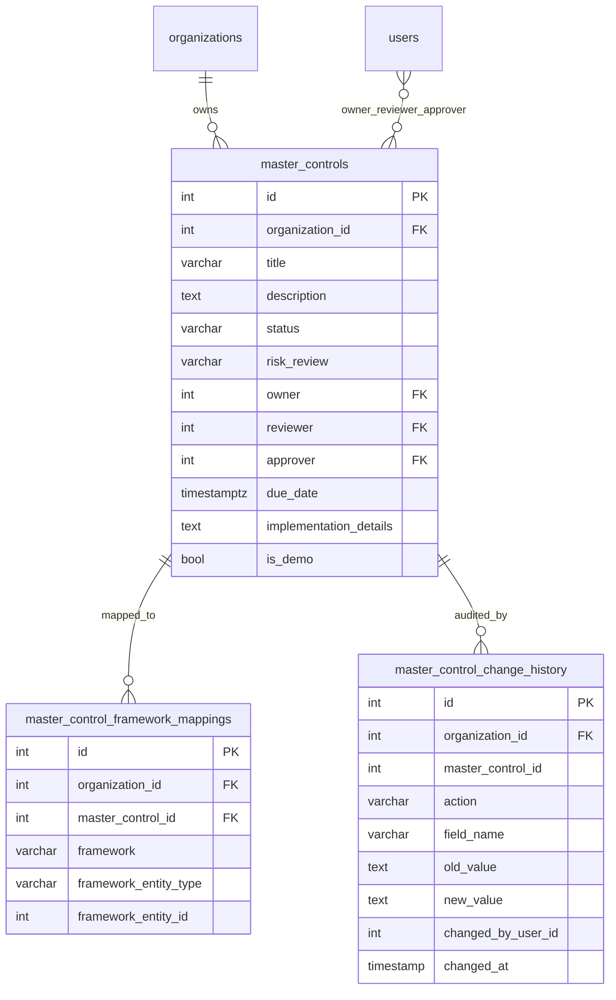

# Controls Hub Domain

## Overview

The **Controls Hub** is VerifyWise's unified cross-framework controls library. An organization that certifies against multiple frameworks (EU AI Act, ISO 42001, ISO 27001, NIST AI RMF) historically had to duplicate the same operational control — evidence, owner, status, due date — across every framework's siloed tracker. Controls Hub introduces a reusable **master control** owned by the organization that is mapped to one or more concrete framework requirements. When the master control's status, owner, reviewer, approver, due date, or implementation details change, the propagation service fans those updates out to every mapped framework row in a single transaction.

This closes the #1 gap vs Enzai identified in our competitive assessment: a single control, governed once, reflected everywhere.

## Data Model

Three new org-scoped tables in the `verifywise` schema. All foreign keys ON DELETE CASCADE from `organizations`.



### `master_controls`

The core control record. `status` is one of `Waiting` · `In progress` · `Done`. `risk_review` is optional and tracks whether a risk review has occurred for this control. `is_demo` flags seeded demo rows that the backend refuses to modify.

Indexes: `(organization_id)`, `(organization_id, status)`, `(owner)`.

### `master_control_framework_mappings`

Junction table linking a master control to a concrete framework requirement row. `framework_entity_type` distinguishes which struct table `framework_entity_id` refers to:

| `framework` | `framework_entity_type` | Target table |
|-------------|-------------------------|--------------|
| `eu_ai_act` | `control_eu` | `controls_eu` (via `controls_struct_eu`) |
| `eu_ai_act` | `subcontrol_eu` | `subcontrols_eu` |
| `iso_42001` | `subclause_struct_iso` | `subclauses_iso` |
| `iso_42001` | `annex_category_iso` | `annexcategories_iso` |
| `iso_27001` | `iso27001_subclause` | `subclauses_iso27001` |
| `iso_27001` | `iso27001_annex_category` | `annexcontrols_iso27001` |
| `nist_ai_rmf` | `subcategory_nist` | `nist_ai_rmf_subcategories` |

Unique constraint `(master_control_id, framework, framework_entity_type, framework_entity_id)` prevents duplicate mappings.

### `master_control_change_history`

Mirrors the shape of every other `*_change_history` table in the codebase so the generic `changeHistory.base.utils.ts` utilities apply without branching. Every create / update / delete / mapping event is recorded against the `master_control` entity type.

## API Endpoints

All routes require JWT auth. Multi-tenant scoping is enforced in the controller via `req.organizationId`. See the `Controls Hub` tag in `Servers/swagger.yaml` for full schemas.

| Method | Path | Description |
|--------|------|-------------|
| GET    | `/api/master-controls` | List master controls (with mapping summary) for the org |
| GET    | `/api/master-controls/:id` | Fetch one master control + its mappings |
| POST   | `/api/master-controls` | Create a master control |
| PATCH  | `/api/master-controls/:id` | Update a master control (sparse patch; propagates) |
| DELETE | `/api/master-controls/:id` | Delete a master control (cascades mappings + history) |
| PATCH  | `/api/master-controls/bulk` | Apply the same sparse patch to many ids |
| GET    | `/api/master-controls/export` | Stream CSV of all master controls |
| POST   | `/api/master-controls/seed-recommended` | Import recommended seed mappings |
| GET    | `/api/master-controls/:id/mappings` | List mappings for a master control |
| POST   | `/api/master-controls/:id/mappings` | Add a framework mapping |
| DELETE | `/api/master-controls/mappings/:mappingId` | Remove a framework mapping |
| POST   | `/api/master-controls/:id/propagation-preview` | Preview which framework rows a patch would touch |
| GET    | `/api/master-control-change-history/:id` | Change-history timeline for a master control |

Routes live in `Servers/routes/masterControl.route.ts` and `Servers/routes/masterControlChangeHistory.route.ts`.

## Propagation Semantics

The propagation service (`Servers/services/masterControlPropagation.service.ts`) implements **one-way** fan-out: master → framework rows. There is no back-propagation from framework rows to masters (out of scope for v1 — see limitations).

Only a fixed subset of master-control fields is propagatable:

```
status · owner · reviewer · approver · due_date · implementation_details
```

`title`, `description`, and `risk_review` live only on the master and never modify framework rows.

### Execution model

1. The controller builds a sparse patch containing only fields the user changed.
2. A single DB transaction opens.
3. The master row is updated.
4. `propagateMasterControlUpdate` selects all mappings for `master_control_id` within `organizationId`, then for each mapping:
   - Looks up the per-entity-type **adapter** (target tenant table, meta-id column, implementation column name — ISO / NIST use `implementation_description`, EU uses `implementation_details`).
   - Builds a translated `SET` clause (e.g. a master status of `In progress` maps to `Partially done` in the EU schema via `FRAMEWORK_STATUS_TRANSLATIONS`).
   - Issues a single UPDATE scoped by `organization_id` + `meta_id_column` = `framework_entity_id`.
5. Per-mapping results (`rowsUpdated`, `skipped`, `reason`) are collected and returned.
6. `trackEntityChanges` records the event on the master timeline; per-framework change history is recorded by the respective framework's hooks.

### Failure handling

- **Adapter missing / no-op translation:** the mapping is skipped (`skipped: true`), the rest of the transaction continues.
- **DB error on any UPDATE:** the transaction is rolled back, the controller returns 500, and no partial state is left behind.
- **Propagation preview:** the same logic runs outside of a transaction (wrapped in a single read-only call) and returns the same `PropagationResult[]` shape without writing anything.

## Change History Integration

The `master_control` entity type is registered in both `Servers/config/changeHistory.config.ts` and `Clients/src/config/changeHistory.config.ts`. The two unions are kept in sync — drift between server and client is a known parity risk and should be caught in review.

The generic `trackEntityChanges` / `recordMultipleFieldChanges` helpers work without special-casing: all timeline rendering on the frontend goes through the shared `HistorySidebar` component in `inline` mode inside the drawer's History tab.

## Seed Mappings

Default mappings for common cross-framework overlaps live in `Servers/structures/master-controls-seed/mappings.seed.ts`. The `POST /api/master-controls/seed-recommended` endpoint inserts one master control per seed entry and attaches its mappings in a single transaction. Rows are created with `is_demo = false` so they can be edited post-import.

The Controls Hub empty state surfaces an "Import recommended mappings" CTA that calls this endpoint.

## CSV Export

`Servers/services/masterControlExport.service.ts` composes a flat CSV. One row per master control with the following columns:

```
ID · Title · Status · Risk Review · Owner · Reviewer · Approver ·
Due Date · Description · Implementation Details · Total Mappings ·
EU AI Act · ISO 42001 · ISO 27001 · NIST AI RMF · Mapped Entity Codes ·
Created At · Updated At
```

The four framework columns hold mapping counts per framework; `Mapped Entity Codes` holds the comma-separated list of canonical framework codes. Quoting follows RFC 4180 — quoted only when the cell contains `,`, `"`, or a newline.

The frontend calls the route via `exportMasterControlsCsv()` in `masterControl.repository.ts`, which streams the response into a Blob and triggers `triggerBrowserDownload`.

## Frontend Surface

Page: `/controls-hub`, lazy-loaded from `Clients/src/application/config/routes.tsx`, entry in the sidebar.

| Component | Path |
|-----------|------|
| Page shell | `Clients/src/presentation/pages/ControlsHub/1.0ControlsHub/index.tsx` |
| Matrix | `…/1.0ControlsHub/ControlsMatrix.tsx` |
| Framework cell | `…/1.0ControlsHub/FrameworkCell.tsx` |
| Drawer | `…/components/MasterControlDrawer/index.tsx` |
| Details tab | `…/components/MasterControlDrawer/DetailsTab.tsx` |
| Mappings tab | `…/components/MasterControlDrawer/MappingsTab.tsx` |
| Evidence tab | `…/components/MasterControlDrawer/EvidenceTab.tsx` |
| History tab | `…/components/MasterControlDrawer/HistoryTab.tsx` |
| Bulk edit bar | `…/components/BulkEditBar/index.tsx` |
| Propagation preview | `…/components/PropagationPreviewModal/index.tsx` |
| CSV export modal | `…/components/CsvExportModal/index.tsx` |

Data access goes through `Clients/src/application/repository/masterControl.repository.ts` and the React Query hooks in `Clients/src/application/hooks/useMasterControls.ts` (`useMasterControls`, `useMasterControl`, `useMasterControlMappings`, `useMasterControlMutations`, `usePropagationPreview`). The domain model is `Clients/src/domain/models/Common/masterControl/masterControl.model.ts`.

## Known Limitations & Future Enhancements

- **One-way propagation only.** Edits made directly on a framework row (e.g. in the EU AI Act compliance tracker) do not flow back to the master. Two-way sync is out of scope for v1 — the assumption is that Controls Hub is the authoritative surface going forward.
- **Orphan mapping detection.** If a framework's struct data changes (seed rerun, ID renumbering), mappings stored by `framework_entity_id` can become stale. A nightly reconciliation job is tracked as future work.
- **No bulk mapping UI.** Mappings are added one at a time via the drawer's Mappings tab. A multi-select picker across framework requirements is a natural follow-up.
- **Status translation is lossy.** A master moving from `In progress` → `Done` translates to framework-specific terminology via `FRAMEWORK_STATUS_TRANSLATIONS`; the reverse is not attempted.
- **Evidence tab reuses file-links** — attached evidence lives on the master control, not on individual framework rows. This is intentional (single source of truth) but means framework-scoped auditors may need to navigate to the master to see the file.
